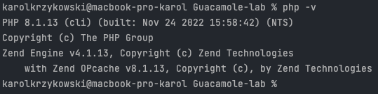

# Guacamole Lab

---

## Spis treści
1. [Instalacja](#instalacja)
2. [Instalacja pod dalszy rozwój](#instalacja-pod-dalszy-rozwój)
3. [Opis struktury systemu](#opis-struktury-systemu)
4. [Endpointy](#endpointy)
5. [Instrukcja obsługi](#instrukcja-obsługi)

## Instalacja

Niniejszy projekt składa się z dwóch części. Pierwszą jest aplikacja webowa zawierająca klienta oraz serwer (ten projekt),
natomiast drugą częścią jest serwer Guacamole. W celu uruchomienia Guacamole należy **TODO**. Mając uruchomiony serwer
Guacamole, można kontynuować instalację aplikacji webowej:
1. Należy zainstalować PHP w wersji 8.0 lub nowszej. W tym celu należy albo udać się na stronę [PHP](https://www.php.net)
i postępować zgodnie z przedstawionymi tam krokami, albo zainstalować z repozytorium danego systemu.
2. Po instalacji PHP należy się upewnić, czy jest on zainstalowany oraz działa prawidłowo. W tym celu należy uruchomić
terminal i wpisać komendę `php -v`. Zwrot powinien wyglądać podobnie do następującego:

3. Następnie należy zainstalować [Dockera](https://www.docker.com) 
4. Jeśli instalacja przebiegła prawidłowo, należy sprawdzić, czy docker działa. Można to zrobić wykonując polecenie 
`docker run hello-world`. Po jego wykonaniu powinien się wyświetlić napis:
    >    Hello from Docker!  
   This message shows that your installation appears to be working correctly.
5. Po zainstalowaniu wymaganych zależności, w katalogu głównym należy wykonać polecenie `php composer.phar install`
6. Następnie należy utworzyć plik `.env` w katalogu głównym projektu i skopiować do niego zawartość pliku `.env.example`.
Następnie należy go uzupełnić odpowiednimi danymi. 
7. Po uzupełnieniu pliku `.env` można uruchomić projekt. W tym celu z głównego katalogu projektu trzeba wykonać polecenie
`./vendor/bin/sail up -d`.
8. Następnie należy zbudować aplikację klienta wykonując polecenie `./vendor/bin/sail npm run prod`
9. Na koniec uruchamiamy migrację bazy danych poleceniem `./vendor/bin/sail artisan migrate`
10. Aplikacja powinna być gotowa i dostępna na wpisanym w pliku `.env` porcie

## Instalacja pod dalszy rozwój

Należy wykonać wszystkie punkty z [Instalacji](#instalacja), z wyjątkiem 8, gdzie zamiast `./vendor/bin/sail npm run prod`
należy wykonać `./vendor/bin/sail npm run watch`.

## Opis struktury systemu

TODO

## Endpointy

TODO

## Instrukcja obsługi

TODO
